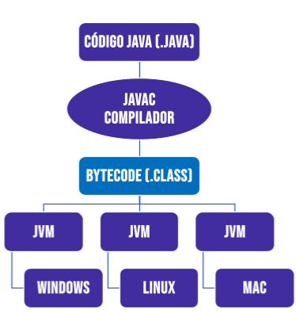

# Conceitos Java  ☕️
Repositório Java para consultas rápidas

## Configurações:

### Java Development Kit
Baixar o JDK para Windows: https://jdk.java.net/ 
Baixar o jdk para Linux | MacOS | Windows: https://www.oracle.com/th/java/technologies/downloads/
Observação: verifique se está ok na variável de ambiente - sistema (JAVA_HOME) e path (pasta bin)

### IDE para Java: IntelliJ IDEA
Gerenciador de IDE da JetBrains: https://www.jetbrains.com/toolbox-app/
Baixe o gerenciador para ser avisado sobre atualizações, aí fica interessante baixar a IDE desejada através desse gerenciador.

💻 Verifique no cmd a version do java: java -version

💻 Abrindo o New Project do IntelliJ, no Project SDK escolha a versão baixada do Java através do add JDK

### Funcionamento do Java

